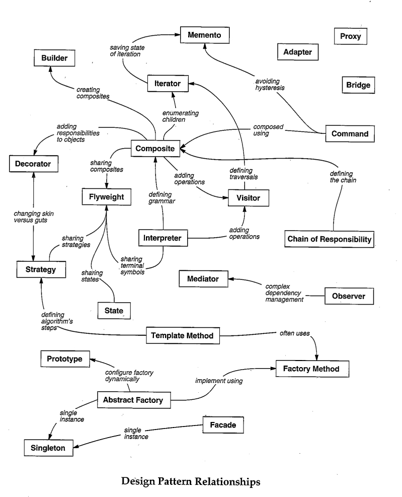

# DesignPattern
###### tags: `degsign_pattern` 
(Creational, structural or behavioral)

## SOLID principle
### Single Responsibility principle
A class should only have a single responsibility, that is, only changes to one 
part of the software's specification should be able to affect the specification 
of the class.

### Open-closed principle
Software entities (class, modules, functions, etc.) should be open for 
extension, but closed for modification.
``
When a single change to a program results in a cascade of changes to dependent 
modules, the design smells of Rigidity. The OCP advises us to refactor the 
system so that further changes of that kind will not cause more modifications. 
If the OCP is applied well, then **further changes of that kind are achieved by 
adding new code, not by changing old code that already works**.
``
### Liskov Substitution principle
"Objects in a program should be replaceable with instances of their subtypes 
without altering the correctness of that program." See also design by contract.

### Interface Segregation principle
"Many client-specific interfaces are better than one general-purpose interface."

### Dependency Inversion principle
One should "depend upon abstractions, [not] concretions."

--------------------------------------------------------------------------------
## pattern

- Overview
    - **Creational patterns**
        - [x] Abstract Factory pattern
        - [ ] [Borg pattern](#Borg)
        - [x] [Builder pattern](#Builder-pattern)
        - [ ] [Factory* pattern](#)
        - [x] [Lazy Evaluation](#Lazy-Evaluation)
        - [x] [Object Pool pattern](#Object-Pool)
        - [x] [Prototype pattern](#Prototype)
        - [x] [Singleton pattern](#Singleton)
        
    - **Structural patterns**
        - [ ] [3-ties pattern](#3-tier)
        - [x] [Adapter pattern](#Adapter)
        - [x] [Bridge pattern](#Bridge)
        - [x] [Composite pattern](#Composite)
        - [x] [Decorator pattern](#)
        - [x] [Facade    pattern](#Facade)
        - [ ] [Flyweight pattern](#Flyweight)
        - [ ] [Front controller](#Front-controller)
        - [ ] [mvc](#mvc)
        - [ ] [proxy](#proxy)
        
    - **Behavior patterns**
        - [ ] [Chain of Responsibility pattern](#Chain-of-Responsibility)
        - [ ] [Catalog   pattern](#Catalog)
        - [ ] [Chaining method](#Chaining-method)
        - [x] [Command   pattern](#)
        - [ ] [Iterator  pattern, Generator  pattern](#Iterator-Generator)
        - [ ] [Mediator  pattern](#Mediator)
        - [ ] [Memento pattern](#Memento)
        - [x] [Observer  pattern](#Observer)
        - [ ] [Publish Subscibe pattern](#Publish-Subscibe)
        - [ ] [Registry pattern](#Registry)
        - [ ] [Specification pattern](#Specification)
        - [ ] [State     pattern](#State)
        - [x] [Strategy  pattern](#Strategy)
        - [x] [Template  pattern](#Template)
        - [ ] [Visitor pattern](#Visitor)
    
    - Design for Testability Patterns
        - [ ] dependency_injection 3 variants of dependency injection
    
    - Fundamental Patterns
        - [ ] delegation_pattern    an object handles a request by delegating to a second object (the delegate)
    
    - Others:

        - [ ] Blackboard    architectural model, assemble different sub-system knowledge to build a solution, AI approach - non gang of four pattern
        - [ ] Graph_search  graphing algorithms - non gang of four pattern
        - [ ] hsm   hierarchical state machine - non gang of four pattern


- Detail
### Creational patterns

#### Builder pattern

##### Summary & TLDR
    TLDR Decouples the creation of a complex object and its representation.
    - A builder is a separate component for building an object
    - Can either give builder an initializer or return it via a static function
    - To make builder **fluent**, `return self`
    - Different facets of an object can be built with different builders working 
    tandem via a base case 
##### Motivation & when to use it 
- Benefits
    - Construction process can be controlled by the director.
    - Useful when many operations have to be done to build an object.
    - Avoid Telescoping Constructor Pattern.
- Drawbacks
    - Not suitable is a mutable object is required.
- When to use
    - To avoid dealing with inconsistent object when the object needs to be 
    created over several steps.
    - To avoid too many constructor arguments.
    - To construct an object that should be immutable.
    - To encapsulate the complete creation logic.
##### Example

---

#### Object Pool
##### What is this pattern
- `Pool`: A pool store(cache) some instance. 
A pool allows check out an inactive object and then return it.
A pool create one instance to provide without wait, if none are available the pool.
- `Object Pool pattern`: preinstantiate and maintain a group of reusable instances of 
the same type in the pool.

##### When to use this pattern
- pros:
    - Offer a significant performance boost
- cons: pass
- when to use:
    the cost of initializing a class instance is high, 
    the rate of instantiation of a class is high, 
    and the number of instantiations in use at any one time is low.
- pitful:
     we don't want a process to have to wait for a particular object to be 
     released, so the Object Pool also instantiates new objects as they are 
     required, but must also implement a facility to clean up unused 
     objects periodically

##### Rules of thumb
- The Factory Method pattern can be used to encapsulate the creation logic for 
  objects.The object pool pattern keeps track of the objects it creates.
- Object Pools are usually implemented as Singletons.

##### Example

---

#### Factory
##### Summary & TLDR
    TLDR Creates objects without having to specify the exact class.

##### Motivation & when to use it 
    Cannot overload with same sets of arguments with different names. 
    Or init turn into 'optional parameter of hell'
    
##### Example
    Two third-party Django packages, `django-widgy`, 
    and `django-query-builder`, 
    use it for generating HTML pages and dynamic SQL queries

#### Lazy Evaluation
##### Summary & TLDR
Delays the eval of an expr until its value is needed and avoids repeated evals.
##### Motivation & when to use it 
##### Example
[bottle](https://github.com/bottlepy/bottle/blob/cafc15419cbb4a6cb748e6ecdccf92893bb25ce5/bottle.py#L270)
[django](https://github.com/django/django/blob/ffd18732f3ee9e6f0374aff9ccf350d85187fac2/django/utils/functional.py#L19)
[pip](https://github.com/pypa/pip/blob/cb75cca785629e15efb46c35903827b3eae13481/pip/utils/__init__.py#L821)
[pyramimd](https://github.com/Pylons/pyramid/blob/7909e9503cdfc6f6e84d2c7ace1d3c03ca1d8b73/pyramid/decorator.py#L4)
[werkzeug](https://github.com/pallets/werkzeug/blob/5a2bf35441006d832ab1ed5a31963cbc366c99ac/werkzeug/utils.py#L35)


#### Prototype
##### Summary & TLDR
    - To implement a prototype, partially construct an object and store it somewhere
    - Deep copy
    - Customize
    - A factory provides a convenient API for using prototype
##### Motivation & when to use it 
    - We make a copy of complicated objects and customize it.(Require copy.deepcopy)
    - To make it more convenient, use it with factory.
##### Example


#### Singleton
##### Summary & TLDR
##### Motivation & when to use it 
    A component which is instantiated only once.
##### Example

### Structural patterns
#### Adapter
    Adapters are used to allow two preexisting objects to work together, even if their interfaces are not compatible.
    Adapter pattern is similar to a simplified decorator pattern. Decorators typically provide the same interface that they replace, whereas adapters map between two different interfaces.
##### Summary & TLDR
##### Motivation & when to use it 
    A construct which adapts an existing interface X to 
    conform the required interface Y.
##### Example

#### Bridge
[References](http://en.wikibooks.org/wiki/Computer_Science_Design_Patterns/Bridge_Pattern#Python)
##### Summary & TLDR
Decouples an abstraction from its implementation.
A client-provider middleman to soften interface changes

##### Motivation & when to use it 
    Bridge prevents a 'Cartesian product' complexity explosion.
    A mechanism that decouples an interface(hierarchy) from an implementation(hierarchy).
##### Example

#### Composite
[References:wikibooks](http://en.wikibooks.org/wiki/Computer_Science_Design_Patterns/Bridge_Pattern#Python)
[References:infinitescript](https://infinitescript.com/2014/10/the-23-gang-of-three-design-patterns/)

##### Summary & TLDR
Describes a group of objects that is treated as a single instance.

##### Motivation & when to use it
Consider for example a program that manipulates a file system. 
A file system is a tree structure that contains Branches which are Folders as 
well as Leaf nodes which are Files. Note that a folder object usually contains 
one or more file or folder objects and thus is a complex object where a file is 
a simple object. Note also that since files and folders have many operations and
 attributes in common, such as moving and copying a file or a folder, 
 listing file or folder attributes such as file name and size, it would be 
 easier and more convenient to treat both file and folder objects uniformly 
 by defining a File System Resource Interface.


##### Example

#### Decorator
The Decorator pattern is used to dynamically add a new feature to an
object without changing its implementation. It differs from
inheritance because the new feature is added only to that particular
object, not to the entire subclass.
[sourcemaking](https://sourcemaking.com/design_patterns/decorator)

##### Summary & TLDR
Adds behaviour to object without affecting its class.
##### Motivation & when to use it 
the new feature is added only to that particular object, not to the entire subclass
##### Example
flask

#### Facade
    dictionary.cambridge
    > the front of a building, especially a large or attractive building
##### Summary & TLDR
    providing a single, simple entry point to a complex system

##### Motivation & when to use it 
    Façade is also useful if you have more than one layer in your system. 
    You can introduce one façade entry point per layer, and let all layers 
    communicate with each other through their façades. 
    That promotes loose coupling and keeps the layers as independent as possible.
##### Example
    [requests](https://2.python-requests.org/en/master/)


#### Flyweight
    The flyweight pattern ensures that objects that share a state can use the same 
    memory for that shared state. But bear in mind that premature optimization is 
    the most effective way to create a program that is too complicated to maintain.
    It is normally implemented only after a program has demonstrated memory problems.
##### Summary & TLDR
##### Motivation & when to use it 
##### Example


### Behavior pattern
#### Iterator Generator
##### Summary & TLDR
##### Motivation & when to use it 
##### Example


#### Observer
    MVC is an architecture and Observer Pattern is an design pattern. They look similar because MVC uses the observer pattern.
##### Summary & TLDR
##### Motivation & when to use it 
    when we want to inform/update one or more objects (observers/subscribers) about a change that happened on a given object (subject/publisher/observable)

##### Example
    1. Kivy, the Python Framework for developing user interfaces, 
    has a module called Properties, which implements the Observer pattern.
    2. The [RabbitMQ](https://www.rabbitmq.com/tutorials/tutorial-three-python.html)
    library can be used to add asynchronous messaging support to an application. 
    Several messaging protocols are supported, such as HTTP and AMQP. 
    RabbitMQ can be used in a Python application to implement a 
    publish-subscribe pattern.


#### State
    A state machine is an abstract machine that has two key components, that is, 
    states and transitions.A nice feature of state machines is that they can be 
    represented as graphs (called state diagrams)

##### Summary & TLDR
##### Motivation & when to use it 
##### Example
    The django-fsm package is a third-party package that can be used to simplify the implementation and usage of state machines in the Django Framework.


#### Strategy
##### Summary & TLDR
##### Motivation & when to use it 
##### Example


#### Template
##### Summary & TLDR
##### Motivation & when to use it 
##### Example


#### Chain of Responsibility
##### Summary & TLDR
##### Motivation & when to use it 
##### Example


--------------------------------------------------------------------------------
## testing
### doctest
```
python -m doctest -v decorator.py
python -m doctest -v generator.py
```

### unittest
```
python -m unittest -v tests/test_structural.py

```

--------------------------------------------------------------------------------
## reference

https://github.com/faif/python-patterns
Mastering Python Design Patterns, By Kamon Ayeva, Sakis Kasampalis, August 2018